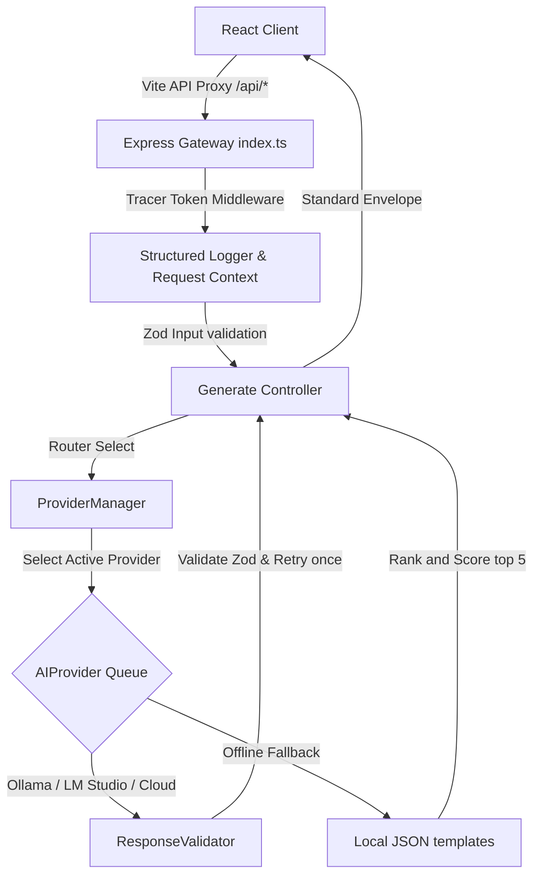

# ProjectPilot.AI 🚀

[](https://www.typescriptlang.org/)
[](https://react.dev/)
[](https://expressjs.com/)
[](https://tailwindcss.com/)
[](https://ollama.com/)
[](https://lmstudio.ai/)
[](https://huggingface.co/)
[](https://groq.com/)
[](https://opensource.org/licenses/MIT)

**ProjectPilot.AI** is a developer portfolio engineering assistant. It generates fully structured, production-grade project blueprints (architecture specifications, directory scaffold trees, database schemas, deployment configurations, and ATS-optimized resume bullet points) matching your skills, preferred framework library, difficulty, and targeted domain, running locally using offline large language models.

---

## 📌 Problem Statement

Engineering job applicants face a crowded, competitive market where simple "todo lists" or basic chat clones no longer impress technical recruiters. To stand out, developers need to showcase complex engineering designs (such as distributed queues, RAG platforms, multi-tenant SaaS structures, and eBPF CLI profilers). 

However, scoping these designs from scratch is time-consuming, and online tutorials rarely provide the production-grade architectural blueprints, API specifications, and infrastructure steps required to build them correctly.

---

## 💡 The Solution

**ProjectPilot.AI** acts as your local software architect. By evaluating your profile settings, it generates five highly customized engineering blueprints. 
To ensure absolute reliability, it features a **decoupled Express gateway** matching multiple local and cloud AI providers (`Ollama -> LM Studio -> Hugging Face -> Groq`), backed by a curated local database of **50 structural templates** that the engine ranks and scores if all LLM servers are offline.

---

## ✨ Key Features

- **Dynamic Profile Intake**: Custom tags intake parsing skills, library frameworks, career objectives, and team modes.
- **Cascading Fallback Queue**: Automatic failover query routing checking `Ollama -> LM Studio -> Hugging Face -> Groq`, and settling on the static Template Engine if servers timeout.
- **Provider Caching & Latency pings**: Smart 30-second TTL cache for model tagging and health statuses with latency measurements.
- **Zod Response Validation**: Robust response validator stripping code markdown, parsing JSON structures, and enforcing schema compliance with auto-retry bounds.
- **Curated Template Database**: A local collection of 50 blueprints scored and ranked against user skills using a math affinity-weighting algorithm.
- **Enveloped REST APIs**: Unified, structured JSON payloads mapped to unique tracing `requestIds` for all API calls and logs.
- **Glassmorphism UI Dashboard**: Visually stunning dashboard supporting three styles: Light Clean, Dark default, and AMOLED Black.
- **Revisit Logs & History**: Retains generation history and bookmarks in local browser buffers.

---

## 🏗️ Architecture Overview



For a comprehensive explanation of components, read the [Architecture Documentation](docs/ARCHITECTURE.md).

---

## 💻 Technology Stack

* **Frontend**: React 18, TypeScript, Vite, React Router, React Hook Form, Tailwind CSS v4, Framer Motion, Lucide Icons.
* **Backend**: Express, TypeScript, ts-node-dev, Axios, Helmet, CORS.
* **Common**: Shared Zod schemas and TypeScript declarations package.
* **AI Tooling**: Ollama, OpenAI API Protocol, Hugging Face Hub inference client, Groq API client.

---

## 📂 Folder Structure

```
new_project/
├── .github/workflows/ci.yml   # CI Build Workflow
├── backend/                   # Express Gateway App
│   ├── prompts/               # System and user prompt templates
│   ├── src/
│   │   ├── config/            # Environment configurations
│   │   ├── controllers/       # Route request handlers
│   │   ├── middleware/        # Security, context, validation middlewares
│   │   ├── routes/            # Router registrations
│   │   └── services/          # AI providers and parsing engines
│   └── templates/             # 50-template categorized database
├── frontend/                  # React Client App
│   └── src/
│       ├── components/        # Layout, form, results, settings panels
│       └── services/          # Client API fetch communications module
└── shared/                    # Common Types & Zod Schemas
```

---

## 🚀 Installation & Quickstart

For full configuration guides, reference the [Deployment & Setup Guide](docs/DEPLOYMENT.md).

### 1. Prerequisites
- [Node.js](https://nodejs.org/) (v20+ recommended)
- [Ollama](https://ollama.com/) (Optional: for running local offline LLMs)

### 2. Clone and Install Dependencies
```bash
git clone https://github.com/Snehith-personal/projects/new_project.git
cd new_project
npm install
```

### 3. Configure Environments
Create a `.env` file in the `backend/` directory:
```env
PORT=5000
OLLAMA_HOST=http://localhost:11434
OLLAMA_TIMEOUT_MS=30000
LMSTUDIO_HOST=http://localhost:1234
LMSTUDIO_TIMEOUT_MS=30000
HUGGINGFACE_API_KEY=your_key_here
HUGGINGFACE_TIMEOUT_MS=20000
GROQ_API_KEY=your_key_here
GROQ_TIMEOUT_MS=15000
```

### 4. Build Monorepo
```bash
npm run build
```

### 5. Start Development Servers
Run both backend and client applications simultaneously:
```bash
npm run dev
```
The React frontend starts on [http://localhost:3000](http://localhost:3000) and proxies API queries to the Express server running on [http://localhost:5000](http://localhost:5000).

---

## 📊 API Endpoints

A detailed API handbook is available in the [API Documentation](docs/API.md).

| Method | Endpoint | Description |
| :--- | :--- | :--- |
| **GET** | `/api/health` | Fetches provider statuses, latencies, version data, and server uptime. |
| **GET** | `/api/providers` | Retrieves list of configured AI gateways and availability indicators. |
| **GET** | `/api/models` | Queries active neural models list for a target provider. |
| **GET** | `/api/version` | Returns system schema, API, and app version details. |
| **POST**| `/api/generate` | Generates 5 ranked project blueprints conforming to profile parameters. |

---

## 📷 Screenshots & Demo Video

Visual placeholders and placement mappings are detailed in the [Screenshots Mappings](docs/screenshots/README.md).
Check out the [3-Minute Demo Presentation Guide](docs/DEMO_GUIDE.md) to record or preview walkthrough configurations.

---

## 📄 License

This project is licensed under the MIT License - see the [LICENSE](LICENSE) file for details.

---

## 👤 Author

* **Snehith** - [GitHub Profile](https://github.com/Snehith1302)
