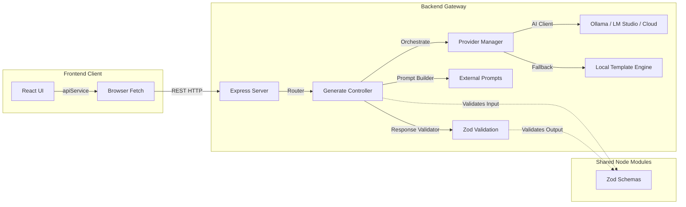

# Architecture Documentation

This document describes the architectural layout, modules, data flow loops, and system boundaries of **ProjectPilot.AI**.

---

## 1. System Architecture

ProjectPilot.AI is configured as a monorepo containing three primary layers:
1. **Frontend**: React-Vite client rendering the UI dashboard.
2. **Backend**: Express gateway server translating client specifications to AI formats.
3. **Shared Package**: Centralized TypeScript declarations and validation schemas.



---

## 2. Frontend Architecture

The client dashboard is a Single Page Application (SPA) compiled via Vite:
- **Routing Loop**: Utilizes client-side `HashRouter` mapping routes:
  - `/` (Home): Promotional landing page.
  - `/generate` (Input Intake): Dynamic user form validating input parameters using React Hook Form and Zod schemas. Includes a 6-step progress loader overlay with cancellation support.
  - `/projects` (Results Dashboard): Project recommendation list and side-by-side metric charts.
  - `/projects/:id` (Details Panel): Tabbed specifications (API Schemas, Directory Structure, Deployment steps, ATS placement bullet points).
  - `/saved` (Saved Blueprints / History): Bookmarks management and history logs.
  - `/settings` (System Configs): Quick Visual select controls toggling visual settings, models list, and retry options.
- **Client Service Layer**: All backend interactions are handled within `frontend/src/services/api.ts`, which injects `AbortSignal` parameters for request cancellation.
- **State Buffer Storage**: The client caches visual configurations, active selections, bookmarks, and previous generation runs within local browser buffers (`localStorage`).

---

## 3. Backend Architecture

The backend gateway is built on top of Express with strict security, routing, and processing boundaries:
- **Security Headers**: Helmet middleware blocks security loopholes (cross-site scripting, header sniffing).
- **Request Tracers**: A custom tracing middleware assigns a unique UUID correlation token (`requestId`) to every incoming request. This tracer is carried into structural JSON logs and returned in standard response envelopes.
- **MVC Layer**: Express routers delegate incoming paths to controller actions. The controllers validate input bounds using Zod middleware before triggering AI pipelines.

---

## 4. Key Architectural Service Modules

### A. Provider Manager (`provider.manager.ts`)
Responsible for AI gateway discovery and load balancing:
- Exposes health checks and model listings for Ollama, LM Studio, Hugging Face, and Groq.
- **Status Caching**: Health responses and latencies are cached with a **30-second TTL** to avoid duplicate network checks.
- **Availability Ranking**: Returns the first healthy provider according to the priority list (`Ollama -> LM Studio -> Hugging Face -> Groq -> Template`).

### B. Prompt Builder (`promptBuilder.service.ts`)
Decouples prompt engineering configurations from application logic:
- Reads prompt definitions from external files (`prompts/system_prompt.md` and `prompts/user_prompt.md`).
- Replaces template parameters (e.g. `{{skills}}`, `{{difficulty}}`) with user form selections.
- Uses strict fallback strings if files are unreadable.

### C. Response Validator (`responseValidator.service.ts`)
Guarantees schema safety before responding to the client:
- Cleans Markdown decorators (e.g. ` ```json ` wrappers) from raw LLM responses.
- Parses string data to JavaScript objects.
- Validates properties against the Zod schema (`ProjectGenerationResponseSchema`).
- **Retry Policy**: Executes automated retries up to the configured limit before throwing schema exceptions.

### D. Local Template Recommendation Engine (`template.provider.ts`)
Serves as the absolute system fallback:
- Loads **50 curated project blueprints** distributed across 5 category files under `templates/` representing AI, Dev Tools, Distributed Systems, SaaS, and Automation.
- **Math Scoring Algorithm**: Computes affinity ranks:
  - **150 points** for matching target domain.
  - **50 points** for matching difficulty tier.
  - **15 points** per matched technology stack keyword.
  - **30–40 points** for career goals affinity.
  The engine filters, ranks, and returns the top 5 blueprints.

---

## 5. Request Lifecycle & Cascading Failover Flow

The step-by-step lifecyle of a generation request:

```mermaid
sequenceDiagram
    participant C as React Client
    participant G as Express Gateway
    participant PM as Provider Manager
    participant AI as AI Server
    participant TE as Template Engine

    C->>G: POST /api/generate (Intake JSON)
    G->>G: Tracer middleware injects requestId
    G->>G: Zod validation runs on request body
    G->>PM: getActiveProvider(overrideName?)
    PM-->>G: Active Provider instance (e.g. Ollama)
    G->>G: Compile external prompts (system / user)
    
    rect rgb(20, 20, 30)
        note right of G: Generation Try block
        G->>AI: generate(prompt) with timeout
        alt Success & Valid JSON
            AI-->>G: Raw LLM String
            G->>G: Validate JSON schemas
            G-->>C: Standard 200 OK Envelope
        else Timeout / Schema Error / Server offline
            G->>G: Log warning containing requestId
            G->>PM: Get next priority provider (e.g. LM Studio)
            G->>AI: generate(prompt) with timeout
            note over AI, G: Repeats fallback cascade until success
        end
    end

    alt All AI Providers Fail
        G->>TE: generate(prompt)
        TE->>TE: Score & Rank 50 local templates
        TE-->>G: Top 5 matched blueprints JSON
        G-->>C: Standard 200 OK Envelope (activeProvider: 'template')
    end
```


