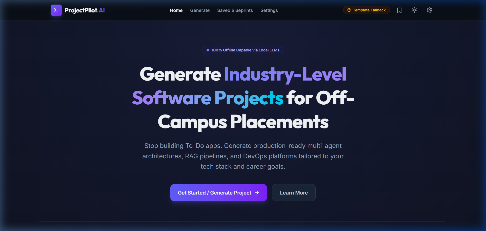
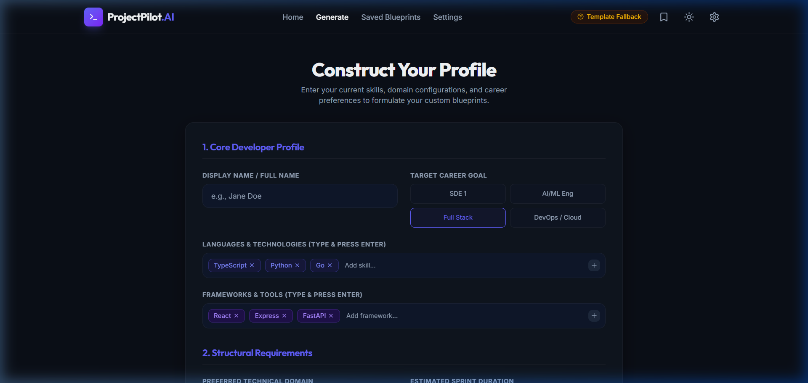
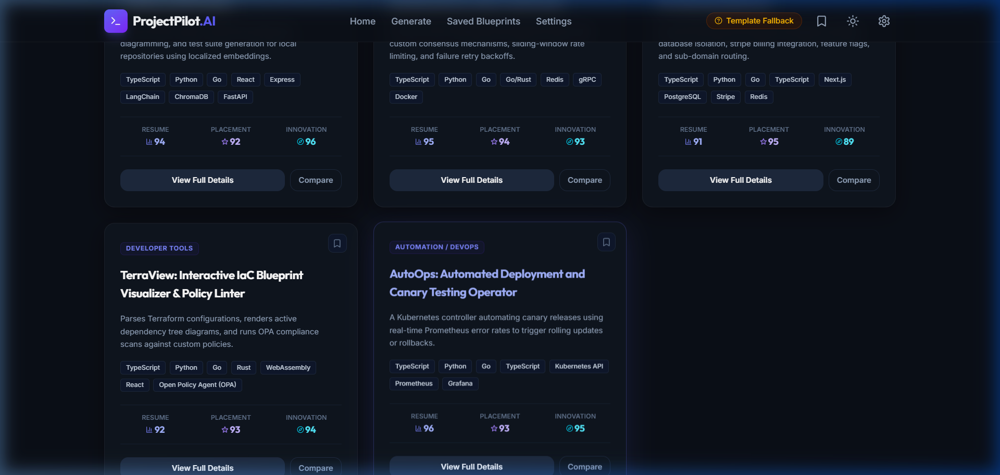
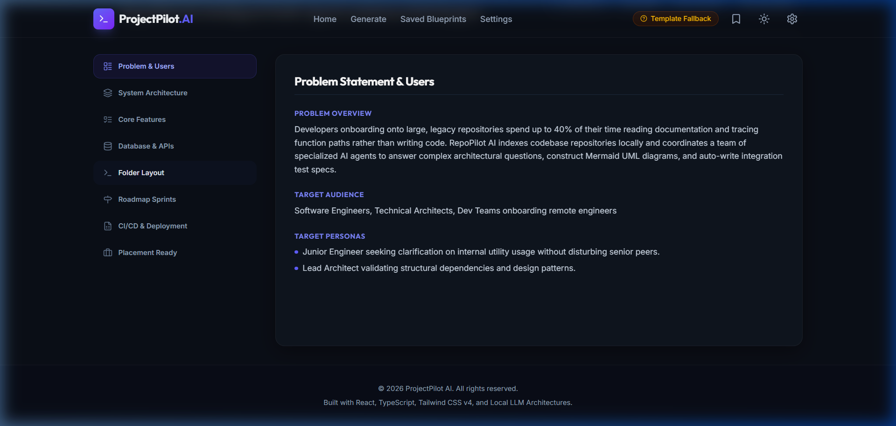
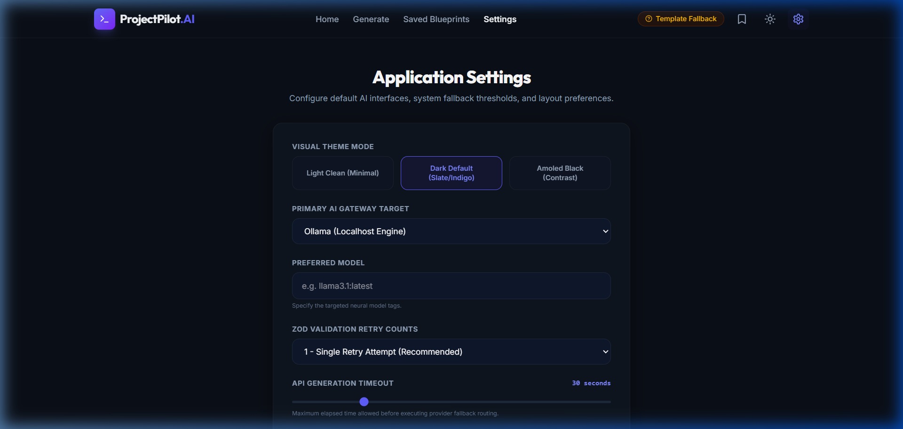
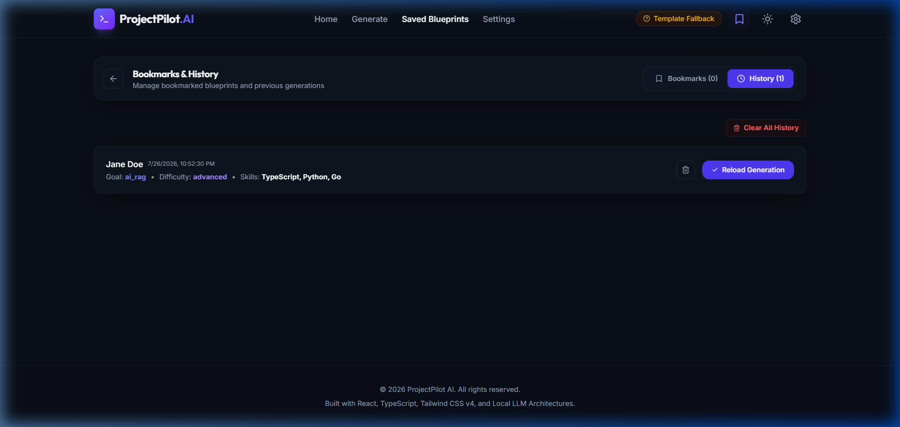
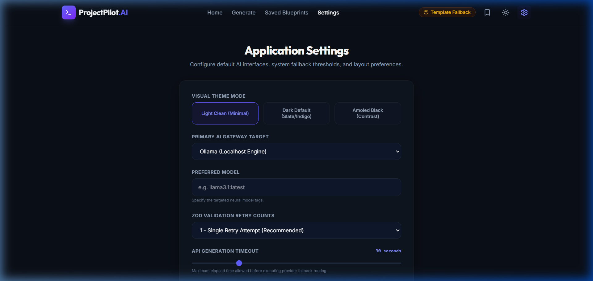

# Application Screenshots & Visual Assets

This directory indexes screenshots demonstrating the visual capabilities and user interfaces of ProjectPilot.AI.

---

## 📷 Screenshots Index

### 1. Landing Page
*Description*: Welcome hero panel detailing core developer workflow steps and initial Call to Actions.

### 2. Profile Intake (Generate Page)
*Description*: React Hook Form input cards scanning developer tags and libraries with manual override toggles.

### 3. Project Recommendations (Results List)
*Description*: Vertical lists comparing metrics like Resume Score and placement ratings.

### 4. Technical Specifications (Project Details)
*Description*: Tabs mapping folder trees, DB schemas, Docker compose, and resume bullets.

### 5. Application Settings
*Description*: Selection cards mapping gateway targets, models list, timeout durations, and active retries count.

### 6. Saved Bookmarks & History Logs
*Description*: The dual-tab component rendering bookmarked files and previous generation logs.

### 7. Dual Themes (Dark & Light)
*Description*: Dynamic transitions supporting clean light mode frost layers and obsidian dark modes.

